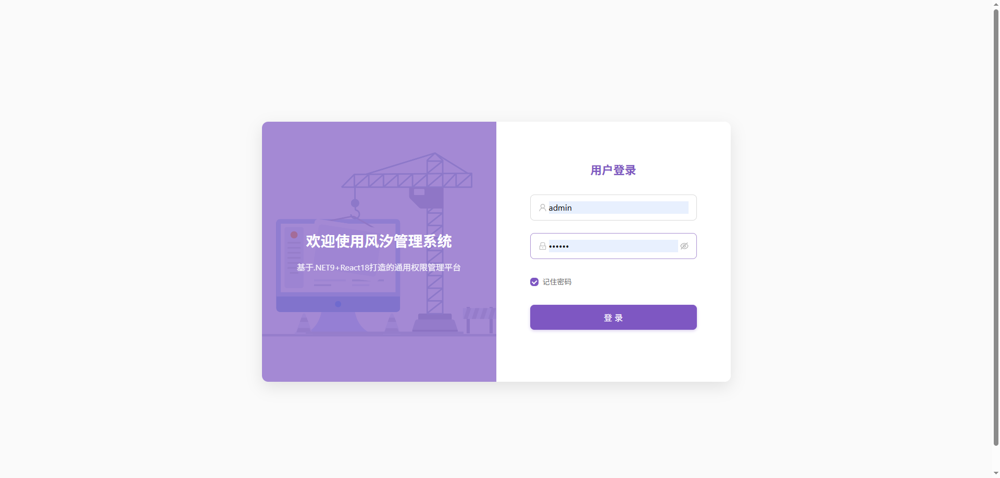
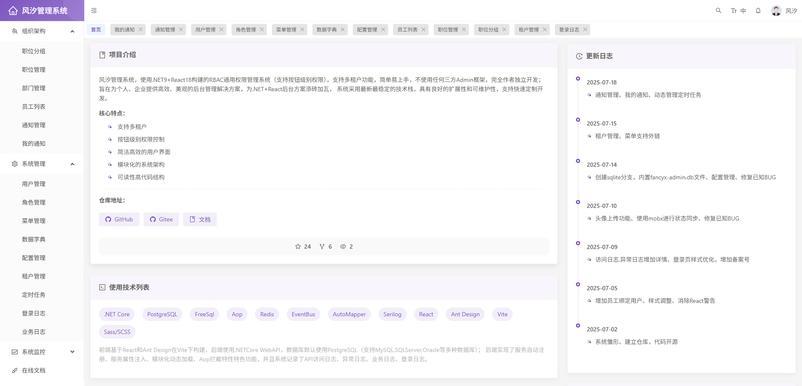
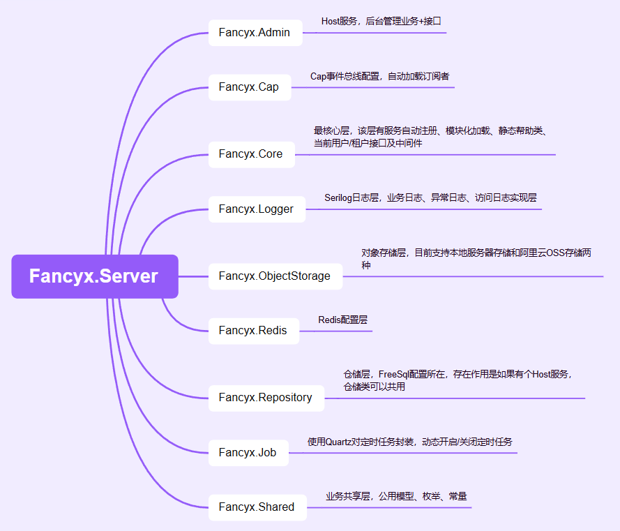
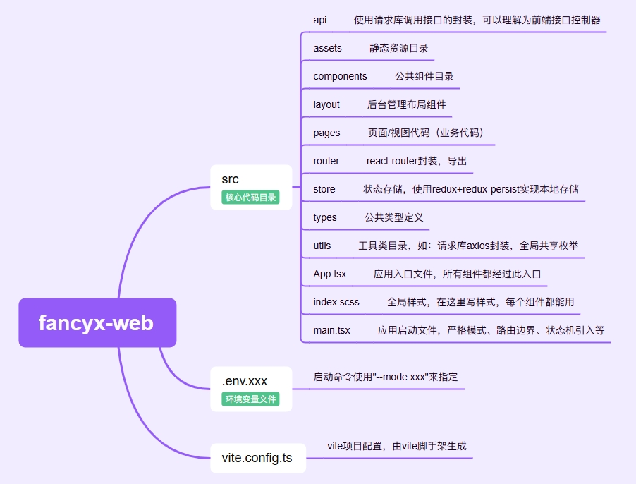

# 乐途开源开发框架(letu.run)

<!-- PROJECT SHIELDS -->

[](https://github.com/letu-ai/letu)
[](https://github.com/letu-ai/letu)
[](https://github.com/letu-ai/letu)


## 项目介绍

乐途开源框架是基于[风汐管理系统](https://github.com/letunet/letu-admin)开发的通用Web框架。

在风汐的基础上主要做了如下改动：
- 选用ABP框架作为底座
- 前端使用Shadcn UI + TailwindCSS
- 调整项目目录结构更便于AI生成代码


**核心特点：**

* 支持多租户
* 按钮级别权限控制
* 简洁高效的用户界面
* 模块化的系统架构
* 可读性高代码结构

## 代码仓库

* GitHub: https://github.com/letu-ai/letu

## 在线预览

- 在线文档： https://docs.letu.run (未开放)
- 预览地址： https://demo.lete.run (未开放)
- 预览账号： admin
- 预览密码： 123qwe* 

**如果在输入账号和密码后提示错误，请检查账号密码输入框中是否存在空格**

> 注意：预览是演示模式，屏蔽了非GET请求

## 使用技术

* .NET Core
* ABP
* PostgreSQL
* FreeSql
* Aop
* Redis
* EventBus
* AutoMapper
* Autofac
* Castle.Core
* Serilog
* React
* Shadcn UI
* Vite
* TailwindCSS

## 功能模块

* 组织架构
  * 职位分组
  * 职位管理
  * 部门管理
  * 员工列表
  * 通知管理
  * 我的通知
* 系统管理
  * 用户管理
  * 角色管理
  * 菜单管理
  * 数据字典
  * 配置管理
  * 租户管理
  * 定时任务
  * 登录日志
  * 业务日志
* 系统监控
  * 在线用户
  * 异常日志
  * 访问日志

## 系统截图

1. 登录


2. 首页


## 快速上手

### 项目结构

**后端**



**前端**



### 配置文件

```json
{
  "Logging": {
    "LogLevel": {
      "Default": "Information",
      "Microsoft.AspNetCore": "Warning"
    }
  },
  "App": {
    //跨域配置
    "CorsOrigins": "http://localhost:8080",
    //是否演示模式
    "DemonstrationMode": false,
    //是否允许一个用户多处同时登录
    "AccountManyLogin": true
  },
  "ConnectionStrings": {
    //连接字符串
    "Default": "Host=数据库地址;Port=5432;Database=数据库名;User ID=账号;Password=密码;"
  },
  "Redis": {
    //Redis连接字符串
    "Connection": "127.0.0.1:6379,password=123456"
  },
  "Jwt": {
    //JWT误差时间（秒）
    "ClockSkew": 300,
    //JWT发布者
    "ValidAudience": "api",
    //JWT发布者
    "ValidIssuer": "letu-admin",
    //JWT签名密钥
    "IssuerSigningKey": "e3b0c44298fc1c149afbf4c8996fb92427ae41e4649b934ca495991b7852b855"
  },
  "Oss": {
    //对象存储路径
    "Bucket": "D:\\Oss",
    //对象存储域名
    "Domain": "http://localhost:5000/",
    //阿里云OSS配置
    "Aliyun": {
      "AccessKey": "", 
      "AccessKeySecret": "",
      "Endpoint": "",
      "Bucket": "",
      "Timeout": 60000,
      "Domain": ""
    }
  },
  "Snowflake": {
    //雪花ID工作ID
    "WorkerId": 1,
    //雪花ID数据中心ID
    "DataCenterId": 4
  },
  "Mqtt": {
    //MQTT服务器暴露端口
    "Port": 1883,
    //MQTT连接账号
    "UserName": "admin",
    //MQTT连接密码
    "Password": "123qwe*"
  }
}
```

### 项目启动

后端项目启动：

* 修改PostgreSQL,Redis配置
* 执行根目录下`dbscripts/xxx/v年月日_column_data.sql`，会创建表结构，初始化数据
* 修改OSS配置，使用本地目录（盘符一定要有，目录不存在会自动创建）
* 使用VS2022调试启动（也可以在Letu.Admin目录下使用`dotnet run`）

前端项目启动：

* 提前安装`pnpm`，运行命令：`npm install -g pnpm`
* 安装依赖包，运行命令：`pnpm install`
* 开发环境启动，运行命令：`pnpm dev`

## 参与贡献

1. Fork本项目
2. 创建您的特性分支 (git checkout -b feature/AmazingFeature)
3. 提交您的更改 (git commit -m 'Add some AmazingFeature')
4. 推送到分支 (git push origin feature/AmazingFeature)
5. 提交Pull Request

## 许可证

本项目采用[MIT](./LICENSE)开源许可，个人或企业均可免费使用

## 联系方式

* 邮箱：stephenevanstehi@gmail.com